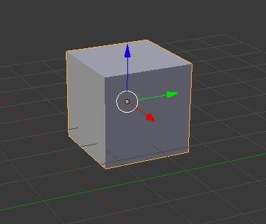

### Coordinate Systems

DIS is about transmitting state information about entities in the world, and the most important state information is where the entities are and which direction they're pointing. This brings up an obvious but important question: what coordinate system do we use to describe an entity's location? It's a tricker question than one might think at first. 

First person shooter games like Call of Duty, World of Warcraft or Skyrim move enties in 3D worlds. The game has to use a 3D graphics library, such as OpenGL, Direct3D, Web3D, or the higher level higher game engine graphics such as OpenSimulator, Lumberyard, or Unreal. That graphics package uses a coordinate system to draw entities. Figure x is a screen capture from the Blender 3D tool that shows a cube that's offset from the graphics coordinate system's origin set at the intersection of the red and green axes.

Figure x

When doing graphics programming we describe the position of the cube (or tank) using the graphics package coordinate system.  Simplicity is a virtue in programming, so we can describe the game world with a coordinate system that assumes the world is infinitely flat in all directions. World of Warcraft can lay out cities and roads for their world on a surface that's infintely flat. This makes the math involved in all this simple. We can use a local coordinate system, but it's a simple transformation to switch between our local coordinate system and that of the game world's.

We don't have as pleasant of a situation when trying to describe the position of entities in the real world. 
Entities are usually positioned on the earth's ellipsoid-shaped surface. If we're trying to realistically model naval warfare, we won't be able to see a ship 100 km away from our ship; it's below the horizon. Using a single, flat coordinate system is not realisitic and can't provide good training when simulations are conducted on that large of a geographic scale. This is shown by a tangent plane touching the surface of the earth in figure x:

Figure x.

There are other problems. In an LVC environment, we're trying to pull together information from multiple sources. The location of buildings or roads is often provided by maps, and the maps are often using latitude and longitude. These days there are petabytes of open source information on the web that's georeferenced, from coffee shop locations and roads to cultural or tribal information. The data's position is usually expressed in latitude and longitude. The Army often uses Military Grid Reference System (MGRS) to describe the position of units. And, as mentioned above, we've got a game graphics package which we're also using to describe the position of entities, and the graphics system coordinate system is flat, rectilinear, and may have its origin tied to a latitude and longitude.  We're trying to integrate positions of entities that are described by multiple coordinate systems, and the organizations that describe the position of things in the world don't know what our simulation is using as a coordinate system. The system World of Warcraft uses--a flat, rectilinear coordinate system for their entire game world--falls apart when it's integrated with data that comes from an ellipsoid-shaped world. (At least if you're not a member of the <a href="https://theflatearthsociety.org/home/">Flat Earth Society</a>.)

Imagine a live ship position feed like Automatic Information System (AIS) that transmits the locations of commercial vessels. We want to fly a virtual aircraft over Monterey Bay and view from the simulator cockpit a representation of live shipping. The virtual aircraft and the live ship feed need a coordinate system in which to place entities. What's more, if the area in which the simulation operates is large enough we need to account for things like the curvature of the earth, and also display accurate representations of roads, buildings, and cities, which our source material likely describes in terms of latitude/longitude or MGRS.

So what coordinate system should be used? DIS has been used in many domains, including sea, subsurface, air, land, and space.  If the simulation's geographic extent is large enough the curvature of the earth can't be ignored. A simulation limted to land operations might choose MGRS. This does not work well for aircraft simulations, where the altitude of an entity is not restricted to the surface of the earth. Naval operations might choose latitude/longitude, but this does not work well for air operations or space operations.  Also, for reasons of convienence we'd like to use a coordinate system that makes local physics calculations easy, or easier. We should also settle on either metric or English units. These goals are in conflict with each other, and some tradeoffs must be made.

DIS versions 5, 6, and 7 chose to use a Cartesian coordinate system with its origin at the center of the earth, and to use meters as the unit of measurement.  The X-axis of this coordinate system points out from the center of the earth and intersects the surface of the earth at the equator and prime meridian. The Y-axis likewise intersects the earth's surface at the equator, but at 90 degrees east longitude. The Z-axis points up through the north pole. This coordinate system rotates wtih the earth; it is sometimes called "Earth-Centered, Earth-Fixed" (ECEF). 

This seems like an odd choice at first glance. The geocentric coordinate system is, in isolation, not very convenient. Suppose we want to move an entity one meter northwest. How much do we change the values of the X, Y, and Z axes in the geocentric coordinate system to accomplish this? That's not intuitively obvious.  The key caveat is that the position of entities described in this DIS coordinate system are only needed when a state update is *sent on the network*. Our simulation can use whatever coordinate system it likes internally, but must transmit its entity positions to other simulations using the geocentric coordinate system.

The advantage of using a geocentric coordinate system is that, with some math, we can convert it to and from other popular coordinate systems. There are equations to convert from a position described with latitude, longitude, and altitude to the geocentric coordinate system, and back again, or example. The same for MGRS. The approach DIS uses to to allow simulations to use any coordinate system they like internally--whatever that simulation feels is convienent--but when transmitting state information on the network, convert from that coordinate system to the DIS geocentric coordinate system. Likewise, when we receive a state update that describes the location of an entity, we have to convert from the geoceentric coordinate system to whatever coordinate system we use internally.

There are a few wrinkles in this. While the geocentric coordinate system origin is placed at the center of the earth, the coordinate system does not by itself define where the surface of the earth is. The earth is not a sphere, but rather a somewhat flattened egg-shaped surface. There are several mathematical models, called "datums," used to describe the shape of the earth. Today the most popular of these is called WGS-84, which is also the model for the shape of the earth used in GPS. It's not exact; the real world's mean sea level can differ from the geoid defined by WGS-84 by 0-5 meters. That may not sound like much when working on a planetary scale, but simulations that are modeling kinetic weapons require high precision for entity locations. A shot by a cannon that's off by two meters may be a clear miss. 

In addition some maps use datums other than WGS-84 for the shape of the earth. The Australians use a datum called GDA-94 on their maps because that works well for modeling the layout of land in Australia; it replaced an earlier datum called AGD-84. Historically the Japanese and Indians have also used their own datums for mapping, as have many nations, and states within the US, because they predate the creation of WGS-84 and GPS, and because they tend to work well for the region of the earth that the map describes. Datums have been argued about for centuries, and it's quite easy to come across a map that does not use WGS-84. Even though the US government has a National Geospatial Intelligence Agency responsible for mapping, the fact is that LVC simulations often use maps or geo-referenced entities from many non-government sources that use different map datums.  

The problem is that using different datums also causes the models for the shape of the earth to differ. Imagine a single entity that has its position described as being 36.5973° N, 121.8731° W. The latitude and longitude lines are clamped to the surface of the earth, and two maps are using different datums. See figure X. There are two different 3D surfaces that the datums describe. An entity described with the same latitude and longitude will be in two different places. Their locations depend on the datum the map uses in addition to the latitude and longitude.

Figure X. (two curves, describe a surface. same lat/lon, different 3D positions.)

How big of a deal is this? Some of the datums described above could result in a difference of up to 200 m from WGS-84. If you place a map that uses one of those datums into an environment that assumes WGS-84 you'll see terrain feature discrepencies even though latitude and longitude for the feature are identical on the two maps.  There may be differences of hundreds of meters. This is illustated in the figure below. The position of the Texas capitol building is described using identical latitude and longitude on all maps, but because the model for the shape of the earth differs between the maps, the position of the capitol building also differs.

Figure x

It's quite easy to come across a map that does not use WGS-84. Even though the US governent has a National Geospatial Intelligence Agency responsible for mapping, the fact is that LVC simulations often use maps or geo-referenced entities from who knows what source. This often manifests itself in LVC simulations when entities are shown driving down a road, but with a 20 meter offset. 

### Terrain

In addition, the earth is not smooth, and terrain can rise above or below the geoid, as Mount Everest, the Dead Sea, or the bottom of the Atlantic Ocean do.

Terrain is a tricky problem in itself and outside the scope (for now) of this document. Simulations need precise placement of objects, often to sub-meter accuracy. Getting agreement on this between simulations that use terrain information from different sources is very difficult. Most simulations hack this lack of accuracy by using *ground clamping*. If an entity such as a tank is described by a companion simulation as being a meter above the ground on the local simulation, the local simulation will simply force it to be drawn as in contact with the ground. This avoids the problem of "hover tanks" that appear to float above the terrain, an artifact that would undermine user confidence in the simulation. But this also means that the position of the entity differs from what the simulation that owns the entity is describing.

### Prefab Packages

There are several packages that convert between the coordinate systems discussed above--geocentric, geodetic, MGRS, and the local coordinate system attached to a manuvering F-16's center of gravity. One popular package is the SEDRIS SRM package. 

<a href="http://www.sedris.org/srm_desc.htm">Sedris SRM site</a>

The SEDRIS site includes tutorials about the theory behind the process and also tutorials about using the Java and C++ packages they provide. If you're doing serious work with position, orientation, and velocity then a prefab package that handles the conversions is highly recommended. You probably shouldn't trust the math I discuss below all that much.

### Position

Most simulations use a local, rectilinear coordinate system for physics and for drawing nearby entities, very similar to what World of Warcraft does. They describe and draw the position of nearby entities using a flat coordinate system. Then, before sending the position of the entity to the network, the simulaton converts it from the local coordinate system to the global, geocentric coordinate system. The math to do these operations is well-understood and efficient.

For example, a simulation might find it convenient to set up a local, flat, rectilinear coordinate system with its origin at a given latitude, longitude, and altitude, tangent to the surface of the earth.

This coordinate system is rectilinear and doesn't take into account the curvature of the earth, but for most simulation purposes it works when entities are within a few kilometers of each other. More importantly, for the most part it's mathematically tractable, and easy to work with in the context of most graphics and physics packages. We can make the local simulation's coordinate system co-extensive with the graphics package coordinate system. If we're using a 3D graphics system like Unity or X3D we can make the graphics system coordinate system match that of the tangent plane we set up.  We can easily move an entity one meter along the X-axis in the local coordinate system.  When we describe the position of the entity to other simulations by sending a PDU, called the Entity State PDU (ESPDU), we convert the position of the entity from the local coordinate system to the global, geocentric coordinate system. 

Many simulations use a East, North, Up (ENU) mapping convention for the local coordinate  system axes, with east along the X-axis, north along the Y-axis, and Z pointing up from the surface of the earth. There's not much agreement on which way the coordinate axes point, though. Another popular convention is NED, north, east, down for X, Y, and Z. Aircraft often use a local coordinate system that puts the origin at the CG of the aircraft, with the X-axis pointing out the nose, the Y-axis out the right wing, and the Z-axis pointing down. Then the position and orientation of the aircraft are described in the context of another local coordinate system. The position of a weapon on the wing of the aircraft needs to undergo several conversions, from the aircraft-centric coordinate system, to the local coordinate system that describes the position of the aircraft, and from there to the geocentric coordinate system. These conventions can be accomodated with enough math.

In this example the position of a tank entity is described in several different coordinate systems. In the local coordinate system--the coordinate system used for most physics and graphics--it's at (10, 10, 4), and that local coordinate system has its origin at latitude 43.21, longitude 78.12, at an altitude 120 meters above the geoid described by WGS-84. In geodetic coordinates the tank is at at latitude 43.21, longitude 78.12 (plus a little for both, to reflect the offset from the origin) and altitude 124. In UTM it's zone 44N, 266061E, 44788172N, 124m. In DIS coordinates it's at (958506, 455637, 4344627). Each of the positions describes the same point in space using different coordinate systems, and we can (with enough math) translate between them.

DIS simulations usually do all their local physics calculations and graphics displays in a local coordinate system which has been picked for the programmer's convenience. When the ESPDU is being prepared to be sent the position of the entity in the local coordinate system is transformed to the DIS global coordinate system, and then set in the ESPDU. When received by the simulation on the other side, that simulation translates from the global coordinate system to whatever its own local coordinate system is.

#### Shut up and give me the equation

To convert latitude, longitude, and altitude to the DIS geocentric ("Earth-Centered, Earth Fixed") coordinate system:

Remember, angles are in radians here. Alpha is latitude, omega is the longitude, a is the semi-major axis of the WGS-84 specification, 6378137, and b, the semi-minor axis of WGS-84, is 6356752.3142.

Converting from DIS coordinates to latitude, longitude, and altitude is a little tricker.

First, longitude: 

Next, latitude. This can be done iteratively for better precision but one iteration gives about five decimal places of accuracy:

Finally, altitude: 

#### By "Give Me the Equation" I Meant "Give Me the Source Code"

A Javascript implementation of coordinate conversion is <a href="https://github.com/open-dis/open-dis-javascript/blob/master/javascript/disSupporting/CoordinateConversion.js">here</a>

The Javascript code to set up a local tangent plane coordinate system is <a href="https://github.com/open-dis/open-dis-javascript/blob/master/javascript/disSupporting/RangeCoordinates.js">here</a>

### Orientation
We can place an entity in the world, but how do we know which way it's facing? In the case of DIS, the convention is to express entity location in terms of sequential rotations about coordinate axes. 

The record expressing orientation has fields for psi, theta, and phi. These represent angles, expressed in radians, in the entity's global coordinate system. First, rotate psi radians around the z-axis which points out the north pole in the DIS coordinate system. Then rotate theta radians around the y-axis, and finally phi radians around the x-axis. The final state, after three rotations, is shown in the image below:

The Austalian Defense Force has published a fine paper on the mathemtatics involved, including the use of quaternions to aid in computation. See the Kok paper below in "further readings."

https://discussions.sisostds.org/index.htm?A3=ind0210&L=Z-ARCHIVE-SISO-ENUM-2002&E=quoted-printable&P=7277&B=--&T=text%2Fhtml;%20charset=UTF-8&pending=

Consider two cases: we want convert a position and orientation of a vehicle at the Naval Postgraduate School in Monterey to the standard used by DIS, and convert the values we get from DIS in a state update to position, with roll, pitch, and heading. It's at 36.5973° N, 121.8731° W, altitude 5 m, and it's pointing +20 degrees from north, with a 5° roll and a 10° pitch.

First of all, we need the postion of the entity as expressed in DIS (aka ECEF) geocentric coordinates. The equation for this is above. There's also an online calculator at <a href="http://www.apsalin.com/convert-geodetic-to-cartesian.aspx">an online source</a>.  The ECEF coordinates are (-2707135.985, -4353750.737, 3781611.558) for that latitude, longitude, and altitude. Next we need to find a coordinate base system rotated to the same orientation as the vehicle (using the NED convention, North=x, East=y, Down=z.)

### Entity Local Coordinate Systems
In addition to the global coordinate system, which are used to position entities in the real world, DIS sometimes uses a local coordinate system to describe items relative to the entity in question. A local coordinate system has its origin at the center of the entity's _bounding volume_. A bounding volume is a closed volume that completely contains the entity. If there's a tank with a complex shape, then a bounding volume might be a box large enough to completely contain the tank. It's useful for creating a computationally efficient algorithms that discover things like entity collisions, and for certain graphics calculations relating to view frustums. In the context of DIS the local coordinate system can be used to describe where, specificaly, a munition impacted on an entity.

The local coordinate systems x-axis points out the front of the entity, the y-axis out the right hand side, and the z-axis points down, in a conventional right-handed coordinate system arrangement.

### Further Reading

Sedris SRM package: <a href="http://www.sedris.org/srm_desc.htm">Sedris SRM site</a> 

SRM Tutorial: <a href="https://www.youtube.com/watch?v=mFFfO-NJMFI">Youtube Tutorial</a> 

SRM Tutorial, hardcopy: <a href="http://www.sedris.org/stc/2000/tu/srm/tsld003.htm">Hardcopy slides</a> 

DTIC manual for coordinate system transformations: <a href="http://www.dtic.mil/dtic/tr/fulltext/u2/a307127.pdf">DTIC Manaul</a> 

Coordinate System Transformation theory: <a href="http://www.springer.com/cda/content/document/cda_downloaddocument/9780857296344-c2.pdf?SGWID=0-0-45-1143141-p174116371">Book Chapter</a>

"Using rotations to build aerospace coordinate systems", Kok: <a href="documents/UsingRotationsToBuildAerospaceCoordinateSystems.pdf">Australian Defence Force paper</a>

WGS precision: https://tools.ietf.org/html/rfc7946

Datums effect on positons: http://www.geo.utexas.edu/courses/371c/Lectures/Fall14/Datums_GCSs_Spring14.pdf
 