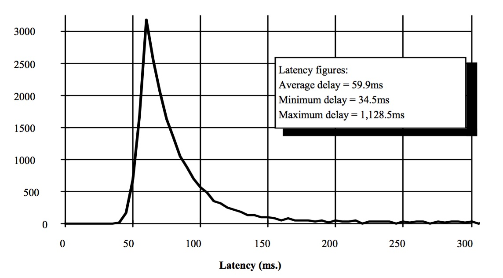

##Latency

Latency is the time it takes for a message to get from one system to another.

Latency is distinct from bandwidth, a measure of the amount of data that can be sent in one time period. It's possible to have a high bandwidth, high latency connection--say, a connection over a satellite in geosynchronus orbit over which we can send 100 MB/sec, but for which it takes 500ms for a message to get from the sender to the receiver. We may also see low bandwidth, low latency connection, over which we can't send very much data, but what data we send arrives quickly. 

Another metric of network performance is Packet Delay Variation (PDV), sometimes called jitter. Jitter is, roughly defined, the variance of the latency. There are multiple specific metrics for PDV. The IETF RFC in the "further readings" section discusses the issues involved.

Latency can pose very complex theoretical problems yet at the same time can have direct practical solutions in some cases. (Spoiler: keep latency low.) As latency increases networked virtual environments can compensate in several ways at the cost of increased simulation complexity. Military simulations may have to operate in high latency environments due to the unique requirements and environments in which they operate.

### The Latency Problem

The essence if a virtual world is creating the illusion that all participants are interacting with each other in the same virtual space. A fundamental problem is that it takes time for an entity state update to get from one application to another.

Suppose the simulation user is looking at the display of a virtual world application and views an entity published by another host. Is the entity really where the display says it is? It depends. 

The host publishing the entity is sending out state updates with the entity's position, and it takes time for the state update to get to our host. The the application that publishes the entity must prepare the update message and send it out over the local operating system's network stack. Then the message must travel across the network, be delivered up our local host's network stack and be handed off to our application, where our application parses the message and updates the graphics display. During that time delay between the publisher preparing the message and the message updating the display in the receiving application the entity may move. Even if two applications are running on the same host the we can still see latency--removing the network transmission time does not reduce latency to zero. Entity location is one example of this phenomenon, but there are others. For example if there is dynamic terrain shared between applications then we want all hosts to have a consistent view of the terrain. More broadly, latency can impact any _shared, dynamic_ state in virtual worlds. 

So is the entity were our display says it is? It could be. For example if the entity hasn't moved for the last 30 minutes it's likely that the shared, dynamic state information is consistent between the cooperating applications, because the state updates were sent and received long ago. 

Even if it's not exactly where we think it is, it may still be close enough. 

If we're doing dead reckoning (sometimes called extrapolation) of the entity's position our application will be using an algorithm to guess about the entity's location. If the entity is traveling in a straight line at a constant velocity and our application is using a dead reckoning algorithm that models that behavior, our application may have correctly estimated the location.  Displays on both hosts show the entity in the essentially the same position. But it may not. If the entity in the publishing application suddenly changes course our application can't discover that fact until a state update with the new direction and state actually arrives. That won't happen, at a minimum, for the full period of the latency between the applications. The two applications will not have completely consistent state information.

###Consistency vs. Throughput

There's a fundamental tradeoff between the consistency of the shared state information and how responsive the applications are. 

Imagine two applications, A and B, that implement a networked virtual environment. Each is publishing entities that move about randomly, so dead reckoning doesn't help us, because dead reckoning depends on predictable movement. Application A will see B's entities a little time lagged, and likewise for B's view of A's entities. It takes some time period, L, to transfer state information between the applications.

At first glance it might appear that we can solve this problem by insisting that all applications have the same state. We'll demand that A and B have exactly the same shared, dynamic state and implement some clever algorithms to make this happen. The distributed database application world loves this stuff, and they've developed algorithms such as distributed two-phased commits that allow atomic (all or nothing) transactions in a networked environment. The problem is that this takes time, and during that time we can't effect still more changes to the dynamic shared state. 

Let's say application A publishes an entity position update. We start our clever algorithm for consistent shared state, which usually involves sending an update, waiting for confirmation that application B is ready to commit the update, and then sending a commit request and waiting for a acknowledgement that the commit has occured. Notice that this requires several round trips, each of time L. Suddenly our update time is several multiples of L, and now our state updates aren't ocurring very quickly. What happens if the user in application A pushes a joystick to moves his entity while we are running our algorithm for consistent shared state on the prior position update? If we insist on completely consistent application state, our application can't update the local entity's position until our distributed update has completed or rolled back. This is very frustrating for the user; he's pushing on the joystick to move his entity, but the entity's position isn't changing. All the applications have consistent shared state, but the throughput and responsiveness is unacceptable. It gets worse if there are also applications C, D, E, and F in the virtual world, and any of the messages in the two-phase commit dance are lost in transmission. Also, notice that the coordination messages needed to coordinate a consistent state take up bandwidth. 

We may not be able to ensure a completely consistent shared dynamic state at all if we also require real time simulation. In a real time simulation the simulation has to advance at the same rate as wall clock time. If several messages need to be exchanged, with L latency each time, we may not be able to execute the transactions as quickly as the state changes occur in real time.

Yet another option is to keep the authoritative game state on a central server. This is a popular technique in commercial games. If someone shoots at someone else the positions of the shooter and target and any physics involved are on the central server. For various reasons (including player cheating) this can be a useful technique, but in the end it just makes the problem look different--now we have to worry about consistency between the client and the authoritative central server. In any event DIS made the design choice to use an entirely peer-to-peer architecture with no central server at all. 

In practice, we almost always accept that the shared states of the applications are a little out of sync with each other in order to get acceptable responsiveness and a simulation that works at all. That creates other problems we'll discuss later.

###How Bad is Latency?

If our application is a map display that receives DIS ESPDUs and plots their position on a map then latency might not matter. A battlefield map may not be adverely affected at all if the entities are one second out of sync with the publishing application because the inconsistencies in the map display are trivial compared to the accuracy the application needs. Virtual simulations are much more sensitive to latency issues, and are the most challenging application to get right. 

The entertainment industry has many first person shooter (FPS) games that demand attention to latency details. FPS games like DOOM, Call of Duty, or Counterstrike are very popular, and players may be scattered across a continent. They have very tight, "twitch" interactions between entities, usually involving avatars shooting at each other with low latency and high precision. Simulations with slower-moving, slower reaction time entities tend to mitigate the effects of latency because the latency-induced position errors are smaller. While some military simulations can be twitch, the military often focuses on training for teamwork and combat drills rather than fast reaction time physical tasks.

Many military simulations are run in one room at a single site, which reduces network latency to the mimimum, often less than 5 ms between hosts that are on the same network, with wireless networks slightly higher.  The latency grows as the network "distance" between the applications increases, with "distance" defined very losely. Every time a network packet crosses a switch or makes a router hop some latency is introduced. In a military environment there are other sources of latency. In an LVC environment it's not uncommon for the state update messages to undergo multiple format changes. A live update from Automatic Information System (AIS) commerical ship position reports may have to have its format changed from the native AIS format to DIS, and then to XML as it transits a security guard between the unclassified and classified networks. From there it may need to be ingested into an HLA simulation or handed off to a C4I system. Some military network links go over satellites in geosynchronus orbit 25,000 miles above earth. The message may be encrypted and decrypted. Home cable modems add around 5-40ms, and DSL modems around 10-70ms. A  dial-up modem can add 100-200ms. (Go be poor somewhere else.) Each of these steps introduces more latency in addition to the network latency.

The speed of light provides a lower bound on network latency. A rough rule of thumb is that crossing one time zone has a minimum of around 10ms of latency. This can only increase depending on the network hops taken and the efficiency of the routers on the path between the hosts.

In addition to network latency there are other sources of lag. A display frame rate of 60 frames per second is pretty good--that's how frequently the display is presenting game state to the user. That translates into 17 ms of lag between frame refresh operations. The virutal world or other type of simulation application also performs a loop the involves receiving data, performing computations, and sending any updates required, which obviously takes some time. That may be a significant factor if complicated physics, AI, or I/O such as database lookups is involved.

The table below shows the observed network latency from the Naval Postgraduate School in Monterey, California (not far from San Francisco and Silicon Valley) to several Amazon Web Services (AWS) regions where Amazon cloud servers are hosted. NPS has a good connection to high speed research networks. Non-academic sites are likely to be worse.

| Region               | Latency (ms) | 
|----------------------|--------------|
| US-East (Virginia)   | 89           |
| US-East (Ohio)       | 85           | 
| US-West (California) | 30           | 
| US-West (Oregon)     | 52 |
| Europe (Ireland)     | 170 |
| Europe (Frankfurt)   | 179 |
| Asia Pacific (Singapore) | 217 |
| Asia Pacific (Sydney) | 194 |
| Asia Pacific (Japan) | 144 |
| Asia Pacific (Korea) | 155 |
| Asia Pacific (Mumbai) | 294 |
| South America (Brazil) | 266 |
| China (Beijing) | 422 |

A graph displaying observed latency between California and Texas (circa 2010) is shown below. The network was operating under "normal" production load, shared with normal network traffic and with no attempts to optimize via quality of service measures. This gives an idea of typical variance in the latency. 

How much does latency affect a simulation? Some estimates for the position errors resulting from various latencies are in the table below.

| Delay  | Tank (100 km/h) | Aircraft (1000 km/hr) | Missile (4000 km/hr) |
|--------|-----------------|-----------------------|----------------------|
| 1000   | 28 m | 278 m | 1111 m |
| 85     |  2 m | 24 m | 94.4 m|
| 60     | 1.67 m | 17 m | 67 m|
| 25     | 0.7 m | 7 m | 28 m |
| 1      | 0.03 m | 0.28 m | 1.1 m |

As you can see, slower-moving entities are less senstitive to latency errors, and fast-moving entities more sensitive. Are the position errors big enough to worry about? That depends on the simulation, but the answer can easily be "yes." In practice, whether a DIS virtual world simulation is "true" is often subjective. The objective of the simulation is often training rather than algorithmic truth. If it's convincing--if it creates a sense of presence and reality, and if the results aren't too far off from ground truth, it can be useful because it trains users to the correct standard. If the simulation is attempting to do analysis and make procurement decisions, this could be a bad assumption.

###Latency and Causation

Latency can also affect perceived cause-and-effect in simulations. Suppose we have an artillery simulator, a tank simulator and a UAV simulator. The latency between the artillery and tank simulator is 10 ms, tank-UAV latency is 20 ms, and artillery-UAV latency is 100 ms. The artillery fires on the tank, and destroys it. The tank simulator changes its state to show itself as destroyed, and sends out a state update.

From the perspective of the UAV the tank will be destroyed before the artillery fires. The artillery fires at t=0, and the tank simulator is informed at t=10. The tank discovers it has been destroyed and changes its state, and the new "destroyed" state arrives at the UAV at time t=30 (or 10 + 20). The artillery simulator's shot appears at the UAV simulator only at time t=100. The tanks explodes, and 70ms later we see the artillery that caused the explosion firing. 

This is sometimes called a causality violation. It may arise from other causes in addition to steady-state latency issues. Remember, UDP makes no guarantees about in-order packet delivery, or reliablity for that matter. It's possible for UDP packets to arrive in a different order than which they were sent.

This can mitigated to an extent, certainly if the messages are being captured and replayed.  The <a href="PDUBundling.md">timestamp</a> field in the DIS PDU header can contain an absolute time hack, the time since the top of the hour.  If the hosts participating in the simulation have their time coordinated via Network Time Protocol (NTP) their clocks can usually be coordinated to within a few milliseconds. Usually the timestamp field is set when the PDU is prepared. If PDUs are being bundled (<a href="PDUBundling.md">Bundling discussion</a>

If the simulation is configured to use absolute time stamps this can be used to order the PDUs in rough absolute time order. 

###Solutions

That's a lot of problems, and not a lot of solutions. That's the nature of the beast. Do what you can to keep latency low. Conventional wisdom in the commercial gaming world is that FPS games should have under 100ms of latency. Human reaction time is around 250ms; if your simulation is trying to do human-in-the-loop, twitch reaction training it can't be much higher than that, and that's very much pushing it. High latencies can be gotten away with for certain types of applications, such as non-virtual simulations. In a high latency environment simulation designs can try to de-emphasize the reaction time component of training, and emphasize things like teamwork or procedures that rely less on reaction time.

FURTHER READING

Sandhep Singhal and Michael Zyda, _Networked Virtual Environments_, Addison Wesley 1999. It's a very good book that discusses many of the fundamental problems in virtual worlds.
  
Two-Phased commits: <a href="https://en.wikipedia.org/wiki/Two-phase_commit_protocol">https://en.wikipedia.org/wiki/Two-phase_commit_protocol</a>

Game latency: https://web.cs.wpi.edu/~claypool/papers/precision-deadline-mmsys/claypool-precision-deadline.pdf

Packet Delay Variance as discussed by the IETF: <A href="https://tools.ietf.org/html/rfc5481">https://tools.ietf.org/html/rfc5481</a>

Cloudping, a tool for finding the average latency to AWS regions: <a href="http://cloudping.mobilfactory.co.kr/">http://cloudping.mobilfactory.co.kr/</a>

An MS thesis devoted to measuring latency in DIS from Captain Drinkwater at AFIT: <a href="documents/DISLatencyThesis.pdf">documents/DISLatencyThesis.pdf</a>