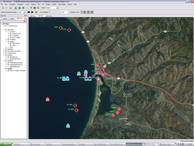

# Live, Virtual, Constructive (LVC)

## LVC

LVC is a fundamental concept in DoD simulations, and reflect efforts by the military to blur the lines between simulation and reality.

*Live* entities represent real entities controlled by real people. An actual physical ship piloted a real person is a live entity, as is a real dismounted soldier. Both entities can transmit position and orientation information that can be ingested into simulations. The simulation consumer can't tell at first glance whether the entity being displayed on the screen is real or simulated.

*Virtual* entities are simulated entities controlled by real people. A simulation user sitting in an aircraft simulator may generate position and orientation updates that are received by other simulations. Those simulations will view the updates as if it were a real aircraft, but it is not. But the person controlling the simulated aircraft is real.

*Constructive* entities are simulated entities controlled by simulated people. Often exercises need large numbers of simulated entities to train users. It's unreasonable to have individuals control each them, so instead they are controlled by Artificial Intelligence (AI) or, to use a less grandiose term, algorithms. A red force rifle regiment may have hundreds of simulated vehicles, each of them controlled by software. 

These distinctions between types of entities in simulations has turned out to be useful in practice. DIS entities can be either live, virtual, or constructive. In practice, DIS entities are most often either virtual or constructive. 

## DIS Example Applications

### Situational Awareness

A classic DIS example application is a map display. Simulations send out entity state update PDUs for each entity. The entity state PDUs (ESPDUs) contain the location of the entity, and an application listening for these on the network can construct a map display of all entities in the simulation.

The map can be implemented as a conventional compiled desktop application written in C++ or Java. The Javascript implementation of Open-DIS when combined with websockets allows ESPDUs to be sent directly into the web page. This enables "mash-ups" with Google Maps or Open StreetMap; icons representing units can be displayed in the web page, and what's more other web-based information can also be integrated.

### Simulation Interoperability

As mentioned, HLA standardizes the API, not the format of messages exchanged. Vendors can pick any format they like for messages. This means that an HLA RTI from MaK Technologies cannot directly exchange messages with an HLA RTI from Pitch Technologies--an incoming binary message from one RTI can't be parsed by the other. If the two HLA simulations are to communicate they must use a gateway or bridge to translate messages. Alternatively one of the simulations may be changed to use the other RTI, so all participants are using RTIs from the same vendor. This can be an impractical approach as the number of participating simulations increases. 

Very often the simulations are using variants of RPR-FOM, which was designed from the start to mimic DIS semantics. A common solution to the HLA interoperability problem is to gateway the HLA simulations to DIS. DIS serves as a common communications backbone and simulation data exchange format.

HLA-to-DIS gateways are common and fairly easy to deploy. It's often easier to get HLA RPR-FOM simulations to communicate with each other via DIS than it is with HLA, particularly as the number of simulations to be connected increases. 

### Virtual Worlds

The original design goal of DIS was to enable the creation of virtual worlds. An example of a virtual world, in this case VBS3 from Bohemia Interactive, is shown below:

VBS3 uses it's own internal protocol for game use, but can easily translate that protocol to DIS.

### Analysis and Playback

Because DIS is a message-based standard, simulation analysis and playback is conceptually simple. An application can simply record all the DIS PDUs it sees on the network, and then play them back. Any existing map-based application will receive the PDUs and display the position of entities. The recorded entities can be played back at greater than real time, and the user can scrub back and forth in the simulation timeline.

The recorded data can also be data-mined. The PDUs can be stored in a database and queried based on PDU field values. An analyst can determine which entities where in which geographic area, how they moved over time, and the types of the entities in the simulation.
