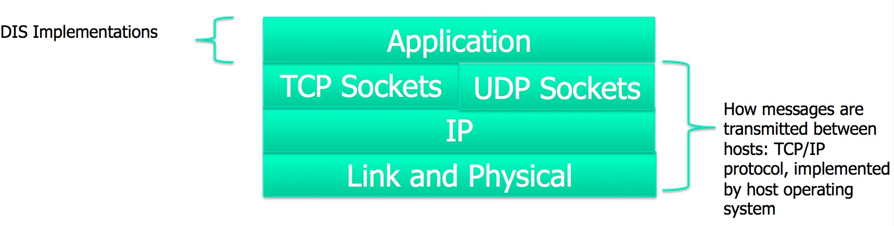

##Networks

Distributed simulations must exchange state information, and almost always they will do that across a TCP/IP network. Networking, like graphics, is an academic subject unto itself. At best we can give a brief overview of the topic.

HLA and TENA try to hide the ugly details of networking under software abstractions. DIS makes no such attempt. It is expected that programmers will be able to open TCP/IP sockets to send and receive information. Some DIS software distributions may also attempt to abstract away networking details, but this is far from guaranteed.

### TCP/IP

One popular block diagram to the TCP/IP stack is shown below:

The application layer is where DIS implementations live. The terminology is sometimes confusing to networking newcomers. The definition of "application" is expansive in TCP/IP, and includes all the code provided by the developer, including graphics, physics, and interpreting and creating network messages. DIS clearly falls into the "application" layer.

In practice DIS is often provided as a compiled library that is linked into an application. The application's programmer may never see the code that parses or creates DIS messages.

Everything below the application layer is usually provided by the operating system.

There are two types of sockets portrayed in the block diagram: TCP sockets and UDP sockets. These two types of sockets optimize for different types of applications.

###TCP Sockets

TCP sockets are point-to-point connections between two hosts on the network. They allow the user to send arbitrary collections of binary or text data. TCP sockets are

* Reliable
* Provide in-order delivery
* Prevent duplicates of packets from being delivered
* Provide rate-limiting

By "reliable" we mean that a message sent will continue to be resent until it is received or the TCP socket is torn down. Networks can be unrelable and out of the control of the sending host. If the sender does not receive a timely acknowledgement of the message being received, it will resend it, with no intervention by the programmer.

When routed through the network some messages may arrive out of order. TCP sockets hide this fact from the receiver. If packets arrive out of order, the receiver will prevent delivery to the application of messages that are out of order.

Likewise, in obscure situations the internet may generate duplicate messages. TCP sockets trap these situations and prevent multiple deliveries of the same message.

Rate limiting can happen if large amounts of data are being transfered quickly. If the sender is a powerful server, and the receiver an iPhone, the receiver won't be able to keep up with all the data being sent. TCP sockets enforce rate-limiting, and force the sender to slow down if the receiver can't keep up.

These all sound like positive qualities, but there are some hidden issues. Suppose we are sending state updates for the position, and one of the messages is dropped by the network somewhere between the hosts. The "Reliable delivery" and "in-order delivery" rules conspire to force the receiving application to be starved of all position updates until the dropped message is resent and received. This is not desired behavior. There's no reason to delay the processing of a position update to wait for a position update that's older.

### UDP Sockets

UDP sockets also allow the transfer of arbitrary binary data between hosts, but they relax the four rules of TCP sockets discussed above. This means that messages from the network may be dropped, or arrive out of order, or be duplicates of prior messages. There is no attempt at rate-limiting, which means that without attention to detail the sender can overwhelm the receiver.

UDP sockets also allow the important capabilities of broadcast and multicast. TCP sockets can transmit messages to only one host at a time. If there are ten cooperating hosts in a simulation, a single state update would have to be sent nine times, once to each of the other nine hosts. Broadcast, available only in UDP, allows a message to be sent once, and received by all other partipants. Multicast is a more sophisticated version of broadcast, which allows a message to be sent only to a specified subset of hosts rather than all of them. Both broadcast and multicast are important tools for implementing scalability.

### In DIS

When DIS was developed broadcast was expected to be the typical transport mechanism, and this convention has largely been carried over. DIS applications often listen on UDP port 3000 for DIS messages. More modern applications use multicast UDP sockets.
